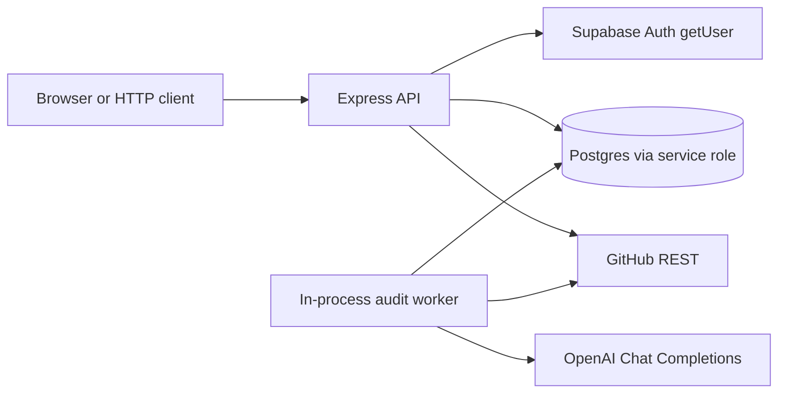

# AI-Native Codebase Technical Writer & PR Auditor

V1 backend for an authenticated user who connects a GitHub repository with a personal access token, syncs its pull requests, and runs an AI audit of one pull request at one commit. The audit stores generated technical documentation, security findings, and a risk level.

This version is for local use and a portfolio demo. It is not a multi-tenant production service. The design keeps provider-specific code behind an interface so GitLab or Bitbucket can be added later, and it keeps the audit worker replaceable, but those pieces are not implemented.

## Architecture

```text
HTTP request
  → Express middleware (request id, logs, helmet, CORS, JSON limit, rate limits, auth)
  → route
  → controller
  → service
  → data layer → Supabase (service role)
  → GitHubProvider / OpenAI client
```



The browser authenticates with Supabase and sends `Authorization: Bearer <access_token>`. The API never trusts a user id from the body or the query string. Ownership is `user → repository → pull request → audit`, and every user-facing query includes the user id in the database predicate. A missing row and someone else's row both return `404 RESOURCE_NOT_FOUND`.

GitHub and OpenAI are reached only from services. Controllers do not call them. The database schema in `database/migrations/001_initial_schema.sql` is the source of truth. It is the same script as `DATABASES/001_initial_schema.sql`. Version 3 adds two service-role functions, described under Schema additions.

## Setup

Requirements: Node.js 20 or newer.

```bash
cd backend
npm install
copy .env.example .env
```

Fill `.env` with your Supabase URL and keys, an OpenAI key and model, and an encryption key:

```bash
openssl rand -base64 32
```

Put that value in `CREDENTIAL_ENCRYPTION_KEY`. Do not commit `.env`.

### Supabase

1. Create a Supabase project.
2. In **Settings → API**, copy the project URL. Prefer the publishable key (`sb_publishable_...`) and secret key (`sb_secret_...`). If the project has not generated those yet, the legacy anon and service-role keys work as `SUPABASE_ANON_KEY` and `SUPABASE_SERVICE_ROLE_KEY`.
3. Open the SQL editor and run `database/migrations/001_initial_schema.sql` on a fresh database. The file at `DATABASES/001_initial_schema.sql` is the same script.

After the migration, run the smoke checks from the bottom of that SQL file:

1. Create a test user through Supabase Auth and confirm a row appears in `public.users`.
2. As `anon` and `authenticated`, confirm `SELECT` on `repository_credentials` and `audit_run_diffs` is denied.
3. Call `public.claim_next_audit('test')` as `service_role` on an empty queue and confirm it returns zero rows.

A new Auth sign-up inserts `public.users` through the `handle_auth_user_created` trigger. The API also upserts that row after a valid token, so a missing profile row is repaired idempotently.

### Commands

```bash
npm run dev        # tsx watch, starts the HTTP server and the audit worker
npm test           # Vitest, no live GitHub, OpenAI, or Supabase
npm run test:watch
npm run build      # tsc to dist/
npm start          # node dist/server.js
npm run lint
npm run typecheck
npm run format
```

`GET /health` returns `200 { "status": "ok" }` with no configuration in the body.

## Environment

See `.env.example` for every variable. Critical values are checked at startup. The process refuses to start when the encryption key is not base64 for exactly 32 bytes, when Supabase or OpenAI settings are missing, when `AUDIT_STALE_AFTER_SECONDS` is below `3 × AUDIT_HEARTBEAT_INTERVAL_MS / 1000`, or when `CORS_ORIGIN` is empty in production.

In development, a blank `CORS_ORIGIN` becomes `http://localhost:5173`. The active origins are logged at startup. The log summary does not include secrets.

`OPENAI_MODEL` must support strict structured outputs on the Chat Completions API. The backend does not hard-code a model name and does not set `temperature`.

Startup also runs `select id from users limit 1` with the secret key. A wrong key or a missing migration stops the process. `supabase.auth.getUser` is called on every authenticated request. Local JWT verification is a later optimization, not part of V1.

## Authentication

The frontend signs in with Supabase Auth and sends the access token as a Bearer token. `requireAuth` checks the header shape, calls `getUser`, and ensures a `public.users` row exists. Missing, malformed, invalid, and expired tokens all return `401 UNAUTHENTICATED`. The token and the Authorization header are not logged. Failures are logged with a reason category only (`missing_header`, `malformed_header`, `invalid`, `expired`).

`GET /api/me` returns the profile. `PATCH /api/me` accepts only `{ "display_name": string | null }`. The string is trimmed and must be 1–100 characters. Unknown keys are rejected. `updated_at` is maintained by the database trigger.

## GitHub personal access token

V1 does not use GitHub OAuth, GitHub Apps, or webhooks. The user supplies a personal access token when connecting a repository. The recommended token is a **fine-grained, read-only** token limited to the target repository, with:

- Pull requests: Read
- Contents: Read

Metadata: Read is implicit. A classic token with the `repo` scope also works, and it is broader than this backend needs. The API only sends `GET` requests.

Connect flow:

1. The body is `{ "repository": "<owner/name or github.com URL>", "token": "<pat>" }`.
2. The token is validated with GitHub.
3. Repository metadata is taken from GitHub, not from the client: provider id, owner, name, canonical HTML URL, default branch, and privacy.
4. An existing repository for this user is matched by provider id, then by owner and name case-insensitively. The new token is re-encrypted with the existing repository id as additional authenticated data, and the stored metadata is refreshed. The response is `200`.
5. A new repository gets a random id, the token is encrypted with that id, and `create_repository_with_credential` inserts the repository and the ciphertext in one transaction. The response is `201`.
6. A unique violation (`23505`) from a race or a case-variant duplicate is turned back into the rotation path. The raw database error is not returned.

The token, ciphertext, and key id are never in the response.

`POST /api/repositories/:repoId/sync` lists pull requests (`state=all`, `sort=updated`, `direction=desc`, 100 per page) up to `GITHUB_SYNC_MAX_PAGES` (default 10). If GitHub still has another page, the result is `truncated: true`. Sync upserts on `(repo_id, pr_number)` and does not overwrite `additions`, `deletions`, or `changed_files`. Those counts are filled when an audit fetches the pull request individually.

GitHub state mapping:

| GitHub | Database `state` |
|---|---|
| `open` and `draft = true` | `draft` |
| `open` and `draft = false` | `open` |
| `closed` and `merged_at` is null | `closed` |
| `closed` and `merged_at` is set | `merged` |

Open and draft rows store null `closed_at` and `merged_at`. A closed row with a missing `closed_at` uses `merged_at`, then `updated_at`. A draft that GitHub also reports as closed follows the closed rules. SHAs are lowercased. The all-zero SHA is rejected.

Upstream `401`/`403` are never returned as our `401`/`403`. While connecting, GitHub `401` is `422 GITHUB_TOKEN_INVALID`. Later, a stored token that GitHub rejects is `409 PROVIDER_CREDENTIAL_INVALID`. A rate-limit `403` is `429 PROVIDER_RATE_LIMITED`. Any other `403` is `409 PROVIDER_PERMISSION_DENIED`. `404` is `404 PROVIDER_RESOURCE_NOT_FOUND`. Network errors, timeouts, `5xx`, and `410 Gone` are `502 PROVIDER_UNAVAILABLE`. `410` means the pinned `GITHUB_API_VERSION` was retired. It is not retried.

Requests set `X-GitHub-Api-Version` (default `2026-03-10`), `Accept: application/vnd.github+json`, and a User-Agent. Timeouts use `AbortSignal.timeout`. Retries are limited to two extra attempts, and only for network errors, `502/503/504`, and rate-limit responses whose wait is at most 10 seconds.

As of the GitHub repository limits documentation checked for this build, pull request diffs are limited to about 20,000 loadable lines or 1 MB total, 300 files, and tighter per-file caps. Those figures are not hard-coded as the trigger for our fallback. A `406`, or a `422` whose body says the diff is too large, falls back to the files API. `AUDIT_MAX_DIFF_FETCH_BYTES` (default 2,000,000) is our read ceiling. GitHub can refuse earlier.

## Encryption

GitHub tokens are encrypted with AES-256-GCM (`node:crypto`) before they are stored.

- Key: `CREDENTIAL_ENCRYPTION_KEY`, base64 of 32 bytes. Key id: `app-v1`.
- IV: 12 random bytes per encryption. Auth tag: 16 bytes.
- Additional authenticated data: `repo:<repository id>`. A ciphertext copied onto another repository row fails to decrypt.
- Serialization: `v1.<iv>.<authTag>.<ciphertext>`, each part base64url.

The service keeps a small key ring keyed by `encryption_key_id`. A future `app-v2` key can be added to decrypt old rows while new writes use the new id. Unknown key ids and tampered ciphertext raise a generic `500 INTERNAL_ERROR` with no key material and no plaintext.

## Audit lifecycle

`POST /api/pull-requests/:prId/audits` checks the user's active audit count, decrypts the token, fetches the pull request from GitHub, updates the stored pull request, and inserts `status = pending` for the fresh head SHA through `create_pending_audit`. That function locks the user row and refuses the insert when the user is already at `MAX_ACTIVE_AUDITS_PER_USER`, so two simultaneous creates cannot both land. The earlier count check remains so a user who is already at the cap does not call GitHub. The response is `202` with `Location: /api/audits/:id`. The handler does not wait for the model.

The in-process worker in `src/workers/auditWorker.ts` is the V1 queue. There is no Redis or external job system. The database is the durable queue.

- `claim_next_audit` atomically moves the oldest pending row to `running`, sets the worker id, and increments `attempts`.
- A heartbeat updates `heartbeat_at` on a timer. Every post-claim update to `audit_runs` is conditioned on `id`, `status = running`, `worker_id`, and `attempts` from the claim. Zero rows means the claim was lost. The worker stops and writes nothing else.
- `recover_stale_audits` runs at startup and about every 30 seconds. A stale `running` row goes back to `pending` while attempts remain, or to `failed` with `AUDIT_ATTEMPTS_EXHAUSTED` when they do not. An exhausted row also stores `duration_ms` from `started_at` to the failure time.
- Handled failures (bad model output, provider errors, empty or oversized diffs, a moved head SHA) are marked `failed` immediately and are not retried. The user can start a new audit.
- Each attempt has a deadline of `AUDIT_MAX_PROCESSING_MS` (default 10 minutes). A timeout aborts in-flight GitHub and OpenAI calls and fails the attempt with `AUDIT_PROCESSING_TIMEOUT`.
- If the repository disappears mid-audit, fenced writes affect zero rows or hit a foreign key. The worker logs a warning and continues.

`audit_run_diffs` still has no worker or attempt columns. `insert_audit_diff_if_owner` locks the audit row, checks `status`, `worker_id`, and `attempts`, and inserts in that same transaction. A superseded worker gets `false` and writes nothing. `ON CONFLICT DO NOTHING` keeps a diff that was already stored for that audit.

History is kept. A completed audit for the same commit can be followed by a new one. Only one `pending` or `running` row may exist for a pull request and commit. A duplicate insert returns `409 AUDIT_ALREADY_ACTIVE`.

Completed audits expose documentation, summary, flags, risk, model, prompt version, token usage, coverage, and timing. Failed audits expose `error_code` and `error_message`. `worker_id`, the raw diff, and credentials are not returned. Pending and running audits expose identity and status only.

### Diff coverage

The raw diff is stored only in `audit_run_diffs`. Analysis keeps whole files. Ordinary source files stay in their original order. Lockfiles, minified files, `dist/`, `build/`, vendored trees, images, and generated files are considered last. A file that does not fit the analysis budget is skipped with reason `size_budget`. If nothing fits, the audit fails with `DIFF_TOO_LARGE`. An empty diff fails with `DIFF_EMPTY`.

`diff_truncated` is true when the analyzed bytes are smaller than the stored diff, or when any file was omitted. The stored omitted list is capped at 200 entries. When coverage is partial, the backend prepends a deterministic notice to `generated_documentation`. More than 20 omitted files are reported as a count.

On the files-API fallback, a missing patch is `binary` only with evidence: an explicit binary flag, or status `renamed` / `copied` / `changed` together with a previous filename or a zero line-count. Every other missing patch is `no_patch`. Files past the fetch cap are `fetch_cap`.

### Model output

The prompt version is `v1` (`AUDIT_PROMPT_VERSION`). Repository content is wrapped in delimiters with a random boundary and is treated as untrusted. The system prompt says instructions inside those delimiters must be ignored. The GitHub token is not part of the prompt. The diff is redacted before it is sent.

Strict structured outputs are validated with a hand-written JSON Schema and a matching Zod schema. A refusal is `AI_REFUSED`. `finish_reason = length` is `AI_OUTPUT_TRUNCATED`. Malformed JSON or a schema violation is `AI_INVALID_OUTPUT` and is not saved. Provider failures after the SDK retries are `AI_UNAVAILABLE`.

Flags whose `file` is set but not among the analyzed paths are dropped. Secret-shaped strings in the model text are redacted again. `risk_level` is the highest of `critical`, `high`, `medium`, and `low`. Info-only findings, or no findings, produce `none`. The model is not asked for the risk level. Token usage is copied from the response. Missing usage is stored as zeros. The stored model name is the snapshot returned by the API, or the configured name if the response has none.

## API overview

Success: `{ "data": ... }`. Lists add `pagination` with `page`, `limit`, and `total`. Errors: `{ "error": { "code", "message", "details?" } }`.

| Method | Path | Notes |
|---|---|---|
| GET | `/health` | Unauthenticated |
| GET, PATCH | `/api/me` | Profile |
| GET, POST | `/api/repositories` | List, connect |
| GET, DELETE | `/api/repositories/:repoId` | Delete returns 204 |
| POST | `/api/repositories/:repoId/sync` | Manual sync |
| GET | `/api/repositories/:repoId/pull-requests` | Optional `state` |
| GET | `/api/pull-requests/:id` | |
| POST | `/api/pull-requests/:prId/audits` | 202 |
| GET | `/api/pull-requests/:prId/audits` | Newest first, no documentation body |
| GET | `/api/audits/:id` | |

`page` defaults to 1. `limit` defaults to 20 and maxes at 100. Unknown body keys are rejected. Unknown query keys are ignored.

## Security model

- Helmet, an explicit CORS allowlist, a 100kb JSON body limit, and centralized errors.
- General API: 300 requests / 15 minutes per IP. Connect and sync: 10 / 15 minutes per user. Audit creation: 10 / hour per user, plus `MAX_ACTIVE_AUDITS_PER_USER` (default 3). Authentication failures: 30 / 15 minutes per IP. `429` responses include `Retry-After`. These numbers live in `src/config/constants.ts`.
- `/health` is registered before the general limiter.
- Structured logs use pino. Authorization headers, cookies, and token-like fields are redacted. Each request gets an `X-Request-Id` (accepted from the client only when it matches a short opaque pattern, otherwise a UUID). Audit processing logs include `audit_id` and `worker_id`.
- Zod failures return field paths, not submitted values.
- Postgres `23505` becomes a controlled conflict. Other database failures become `500 INTERNAL_ERROR` without SQL text.
- The service does not install dependencies, run scripts, or shell out with repository input.
- `SUPABASE_SECRET_KEY`, `OPENAI_API_KEY`, `CREDENTIAL_ENCRYPTION_KEY`, GitHub tokens, ciphertext, and the unredacted raw diff are not returned by any endpoint.

Secret redaction is high-confidence pattern matching for GitHub tokens, AWS access key ids, `sk-` style keys, Slack tokens, PEM private keys, and JWT-shaped strings. It is not a guarantee that no secret can reach OpenAI. Known shapes are redacted before the diff is sent. The raw diff kept in `audit_run_diffs` is not redacted.

Rate limits and the worker are in-process. More than one API instance needs a shared limiter store and a real queue. V1 does not add them.

## Known V1 limitations

- Sync and audits are manual. There are no webhooks, no comments posted back to the pull request, and no repository-level documentation.
- The worker runs inside the API process. A crash after OpenAI succeeds and before the fenced completion write is an extra, otherwise harmless model call. Processing is at least once for that narrow window.
- Raw diffs are unredacted proprietary source. They are kept until something deletes the audit or the repository. Browser roles cannot read them. Anything with the secret key can. They are included in ordinary database backups. A retention policy is left for a later version.
- Redaction does not catch every secret shape.
- Horizontal scaling is out of scope. The rate limiter and the worker do not coordinate across processes.
- `TRUST_PROXY=true` trusts one proxy hop so IP limits work behind a reverse proxy. It is false by default.

## Schema additions

`001_initial_schema.sql` is still the one script to run on a fresh database. If an older copy was already applied, do not run this file again. These are the v3 changes:

- `create_pending_audit(p_user_id, p_pr_id, p_commit_sha, p_max_attempts, p_max_active)` locks `public.users` for that user, checks ownership, counts `pending` and `running` audits, and inserts only when the count is below `p_max_active`. Over the cap raises SQLSTATE `P0001` with message `TOO_MANY_ACTIVE_AUDITS` (`429`). A pull request the user does not own raises `P0002` (`404`). A duplicate in-flight commit still raises `23505` (`409 AUDIT_ALREADY_ACTIVE`).
- `insert_audit_diff_if_owner(p_audit_id, p_worker_id, p_attempts, p_raw_diff)` locks the audit row and inserts the diff only when that claim still owns it. It returns `false` when the claim was lost or the audit is gone. It never overwrites an existing diff.
- `recover_stale_audits` sets `duration_ms` when it fails an exhausted audit.
- `audit_run_diffs.raw_diff` must contain non-blank text.

Both new functions are executable only by `postgres` and `service_role`.

## Schema concerns

- `claim_next_audit` returns the full `audit_runs` row, including `worker_id`, to the service role. That value is used for fencing and is not part of any HTTP response.
- The active-audit cap is enforced inside `create_pending_audit`. A direct insert into `audit_runs` that bypasses the function would not take the lock. The backend does not do that.
- A diff stored by an earlier attempt of the same audit row is kept if a later attempt reaches the insert. The later attempt still verifies the head SHA before it calls the function, and it analyzes the diff it just fetched.

## Minor assumptions

- The package is ESM. TypeScript uses `NodeNext`, and relative imports use `.js` specifiers.
- TypeScript is pinned to 6.0.3. `typescript-eslint` 8.71.0 does not accept TypeScript 7, which was current when the dependencies were pinned.
- `TRUST_PROXY` accepts only `true` or `false`. `true` sets Express `trust proxy` to 1.
- The auth-failure budget of 30 failures per 15 minutes is the V1 choice. The spec requires a stricter per-IP limiter and does not fix the number.
- Request bodies use Zod `.strict()`. Query strings ignore unknown keys. `page` cannot exceed 10,000. Sync page count is capped at 100, worker concurrency at 32, and heartbeat interval at a minimum of 1 second. Those bounds are startup guards, not product features.
- Repository references accept `owner/name` and `github.com` HTTP URLs, including a trailing `.git`. SSH URLs are rejected.
- Case-insensitive owner/name lookup uses PostgREST `imatch` (`~*`) with an anchored, escaped pattern.
- Ownership joins use PostgREST embedded filters such as `repositories.user_id`. Credential rotation confirms ownership with that join, then updates the credential row by `repo_id`.
- Reconnecting a repository refreshes owner, name, URL, default branch, visibility, and provider id from GitHub, in addition to replacing the ciphertext.
- `provider_pr_id` is GitHub's numeric id as text. A null `user` becomes a null `author_login`. A blank head branch is stored as null. A blank base branch is stored as `main`.
- An invalid commit SHA from GitHub is `422 VALIDATION_ERROR` and is not written. Placeholders and the all-zero SHA are rejected.
- `flag_count` on audit lists is the length of `ai_security_flags`. The list query does not select `generated_documentation`. There is no generated count column.
- Failed audit reads include `duration_ms` along with the error fields. Pending and running reads are `id`, `pr_id`, `commit_sha`, `status`, and `created_at`.
- `diff_bytes` is the size of the diff text this service stored, not the size GitHub refused to send. Using the files API does not by itself set `diff_truncated` when every file was included and none were omitted.
- The partial-analysis notice is prepended after Zod validation, so stored documentation can be slightly longer than the 20,000 character model ceiling. The 1–3 sentence summary rule is in the prompt. Zod enforces the 600 character maximum.
- `REPOSITORY_ACCESS_LOST` is used when the credential row cannot be loaded for an audit that still exists. A GitHub `404` stays `PROVIDER_RESOURCE_NOT_FOUND`, matching the HTTP mapping table.
- GitHub JSON responses are also read with a 5 MB cap so a hostile payload cannot be buffered without a limit. That cap is separate from the diff cap.
- A successful connect logs repository ids, not tokens. The in-process worker exposes `wake()` so a new audit is claimed without waiting for the full poll interval.
- Optional database tests in `tests/db/` run only when `TEST_DATABASE_URL` is set. They use the `pg` package, which is not installed by default, because the required test suite does not talk to Postgres. The migration file itself is asserted in the always-on tests.
- Route misses return `404 ROUTE_NOT_FOUND`. Missing or unowned resources return `404 RESOURCE_NOT_FOUND`. A body over 100kb returns `413 PAYLOAD_TOO_LARGE`.
- The Bearer scheme match is case-insensitive and requires one space before the token.

## Production considerations

Do not point this V1 build at strangers' repositories. Before that, replace the in-process worker and rate limiter, add a retention policy for `audit_run_diffs`, review the redaction limits, and move token verification off the per-request Auth HTTP call if the latency matters. Keep the secret key, the OpenAI key, and the encryption key on the server only.
